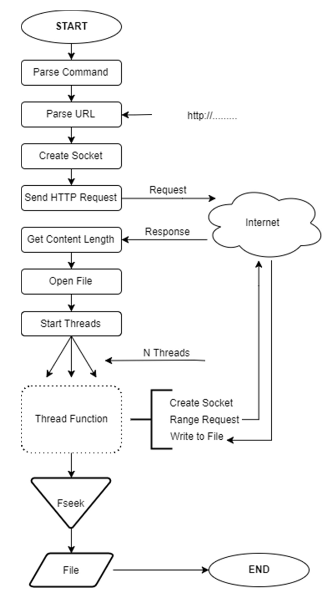

# Partial Http Downloads with Multithreaded HTTP Client

## 1. Problem

Problem is to write a multithreaded HTTP client that allows the partial download of binary formatted static fıles such as mp3, zip, jpeg, gif formatted fıles.
Each thread is responsible for downloading one of the equal sub-parts of the target file. If any of the threads completes its job before others then it is your choice to give another part of the target file as a new downloadable part to that thread. After the download completed, the downloaded file should be ready to use.

## 2. Solution

The solution is to divide the file to be downloaded into threads as sub-problems.
Each thread tries to read data from different sockets at the same time and writes the bytes to the correct positions of the file.
Before reading the HTTP response, each thread knows, which part of the file will be downloaded by itself and requests a range of bytes from the server.
If we entitle each thread as 0 to N. Every thread from 0 to N will be downloaded equally parts. Only Nth thread will be download a remaining part additionally.

## 3. Steps

**1. Getting User Inputs**  
   Parsing command-line inputs to get information about the target file and thread number.  
**2. Parsing URL**  
   Parsing URL is given as an input to get connection information to connect over socket-like, hostname, port number, identifier and file name.  
**3. Socket Connection**  
   Creating a multi-socket connection between the given host and binds to the ports.  
**4. Sending HTTP Request**  
   Creating an HTTP Request header and write it to the socket to send an HTTP Request to the server. After making the request, read the first part of the response from the server. The first response contains the HTTP Response.  
**5. Parsing First Response**  
   Parsing HTTP Response and getting the content length and store it on the global variable. And then dividing it by thread number.  
**6. Thread Function**  
   In thread function each thread creates a socket then calculates base and limit points, after this point, every thread makes an HTTP range-request. By bytes has read, each thread writes the buffer to correct position of file with fseek function. Read-Write operations are protected by a mutex. Only last thread will be download a remaining part additionally.  
**7. Termination**  
   Close file, socket connections and return SUCCESS.  

## 4. Algorithm Flow Chart

<p align="center">
    
</p>

## 5. Usage

```sh
./c-posix-downloader [ -h help ] –u URL -t thread count
```
